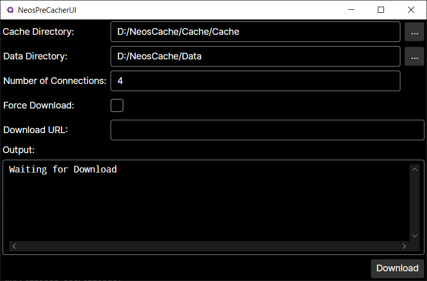

# NeosPreCacher

[>>> DOWNLOAD <<<](https://github.com/jackybuns/NeosPreCacher/releases/latest)

Is a tool used to download bigger files and put them into the NeosVR cache while Neos is not running to save on resources. Useful for downloading movies for example.

**>>> I don't take any responsibility if your Neos database gets corrupted or destroyed using this tool. Use at your own risk. <<<**

# Usage 

Open the app, check if your cache and data directory are the right ones. Uses the Appdata once by default. If you use a custom neos cache or data location you definitely need to change that.

Paste your URL into the `Download URL` box and click download.

On the first run it also downloads [aria2](https://aria2.github.io/) which is used for downloading the files.

# Building

You need to have NeosVR installed and set the environment variable `NEOS_DIR` to the Neos install root directory. For example if you have the standalone build, set it to `C:\Neos\app`.
